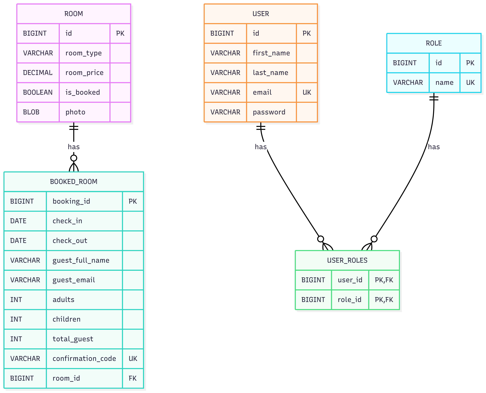
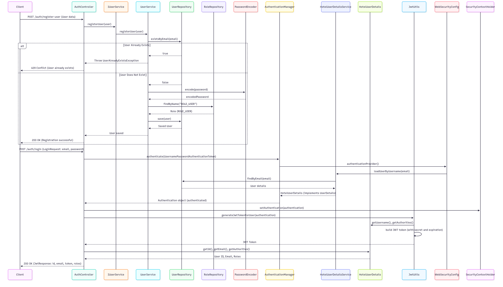
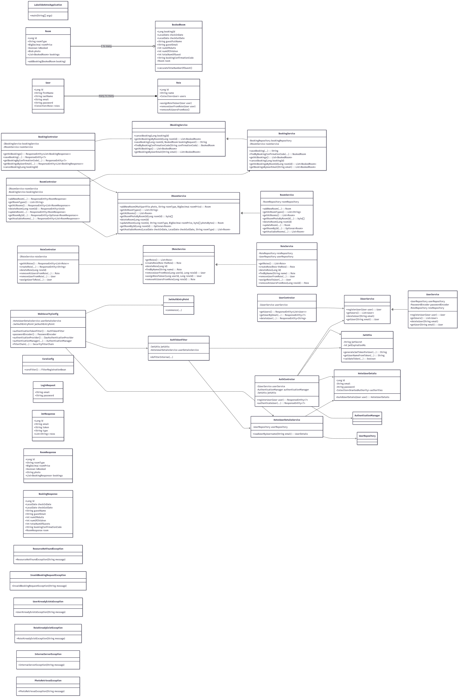

# Lakeside Hotel Booking Website

A comprehensive backend application for a hotel booking system, built with Spring Boot. This project provides a robust API for managing rooms, bookings, users, and roles, including secure authentication and authorization with JSON Web Tokens (JWT).

## 🚀 Features

* **Room Management**: Add, view, update, and delete various types of rooms with photos.
* **Booking Management**: Allow guests to book rooms, retrieve booking details by confirmation code, and cancel bookings.
* **User Authentication & Authorization**: Secure user registration and login with JWT.
* **Role-Based Access Control (RBAC)**: Differentiate between user roles (e.g., ADMIN, USER) to control access to specific functionalities.
* **Search & Availability**: Find available rooms based on check-in/out dates and room type.
* **Error Handling**: Robust exception handling for various scenarios like resource not found, invalid requests, and conflicts.
* **Database Integration**: Configured for MySQL or PostgreSQL (currently set up for MySQL in `application.properties`).
* **Lombok**: Reduces boilerplate code.

## 🛠️ Technologies Used

* **Spring Boot**: Main framework for building the application.
* **Spring Data JPA**: For database interaction and ORM.
* **Spring Security**: For authentication, authorization, and JWT integration.
* **JWT (JSON Web Tokens)**: For secure API authentication.
* **Maven**: Dependency management and build automation.
* **MySQL/PostgreSQL**: Relational database (configured for MySQL by default).
* **Lombok**: To simplify model classes with annotations like `@Getter`, `@Setter`, `@NoArgsConstructor`, `@AllArgsConstructor`, `@Data`.
* **Jakarta Validation**: For request body validation.
* **Apache Commons Lang3**: For utility functions (e.g., `RandomStringUtils` for booking codes).
* **Jackson Databind**: For JSON processing.

## ⚙️ Setup and Run

### Prerequisites

* Java 21 or higher
* Maven
* MySQL or PostgreSQL database server running (and configured as per `application.properties` or `application.yml`)

### Database Setup

1.  **MySQL**:
    * Create a database (e.g., `lakeSide_hotel_db`).
    * Update `src/main/resources/application.properties` with your database credentials:
        ```properties
        spring.datasource.url=jdbc:mysql://localhost:3306/lakeSide_hotel_db
        spring.datasource.username=your_username
        spring.datasource.password=your_password
        ```
2.  **PostgreSQL (if preferred)**:
    * Comment out `application.properties` and uncomment `application.yml`.
    * Update `src/main/resources/application.yml` with your PostgreSQL credentials:
        ```yaml
        spring:
          datasource:
            url: jdbc:postgresql://localhost:5432/lakeside_hotel_db
            username: your_username
            password: your_password
            driver-class-name: org.postgresql.Driver
        ```
    * Ensure the PostgreSQL driver dependency is present in `pom.xml` (replace mysql-connector-j if needed).

### Running the Application

1.  **Clone the repository**:
    ```bash
    git clone <repository_url>
    cd Hotel-Booking-Website
    ```
2.  **Build the project**:
    ```bash
    mvn clean install
    ```
3.  **Run the application**:
    ```bash
    mvn spring-boot:run
    ```
    The application will start on port `9192` (configured in `application.properties`).

## 🗺️ API Endpoints

Base URL: `http://localhost:9192`

### Authentication (`/auth`)

* **`POST /auth/register-user`**: Register a new user.
    * Request Body: `{"firstName": "...", "lastName": "...", "email": "...", "password": "..."}`
* **`POST /auth/login`**: Authenticate a user and receive a JWT token.
    * Request Body: `{"email": "...", "password": "..."}`

### Rooms (`/rooms`)

* **`POST /rooms/add/new-room`**: Add a new room (ADMIN only).
    * Request Parameters: `photo` (MultipartFile), `roomType` (String), `roomPrice` (BigDecimal)
* **`GET /rooms/room/types`**: Get all distinct room types.
* **`GET /rooms/all-rooms`**: Get all rooms with photos.
* **`GET /rooms/room/{roomId}`**: Get a room by ID.
* **`GET /rooms/available-rooms`**: Get available rooms by dates and type.
    * Request Parameters: `checkInDate` (LocalDate), `checkOutDate` (LocalDate), `roomType` (String)
* **`PUT /rooms/update/{roomId}`**: Update room details (ADMIN only).
    * Request Parameters: `roomType` (Optional String), `roomPrice` (Optional BigDecimal), `photo` (Optional MultipartFile)
* **`DELETE /rooms/delete/room/{roomId}`**: Delete a room (ADMIN only).

### Bookings (`/bookings`)

* **`POST /bookings/room/{roomId}/booking`**: Book a room.
    * Request Body: `{"checkInDate": "YYYY-MM-DD", "checkOutDate": "YYYY-MM-DD", "guestFullName": "...", "guestEmail": "...", "numOfAdults": ..., "numOfChildren": ...}`
* **`GET /bookings/confirmation/{confirmationCode}`**: Get booking details by confirmation code.
* **`GET /bookings/all-bookings`**: Get all bookings (ADMIN only).
* **`GET /bookings/user/{email}/bookings`**: Get bookings by user email.
* **`DELETE /bookings/booking/{bookingId}/delete`**: Cancel a booking.

### Users (`/users`)

* **`GET /users/all`**: Get all registered users (ADMIN only).
* **`GET /users/{email}`**: Get user details by email (USER/ADMIN).
* **`DELETE /users/delete/{userId}`**: Delete a user (ADMIN or the user themselves).

### Roles (`/roles`)

* **`GET /roles/all-roles`**: Get all available roles.
* **`POST /roles/create-new-role`**: Create a new role (ADMIN only).
    * Request Body: `{"name": "..."}`
* **`DELETE /roles/delete/{roleId}`**: Delete a role (ADMIN only).
* **`POST /roles/remove-all-users-from-role/{roleId}`**: Remove all users from a specific role (ADMIN only).
* **`POST /roles/remove-user-from-role`**: Remove a specific user from a role (ADMIN only).
    * Request Parameters: `userId`, `roleId`
* **`POST /roles/assign-user-to-role`**: Assign a role to a user (ADMIN only).
    * Request Parameters: `userId`, `roleId`









